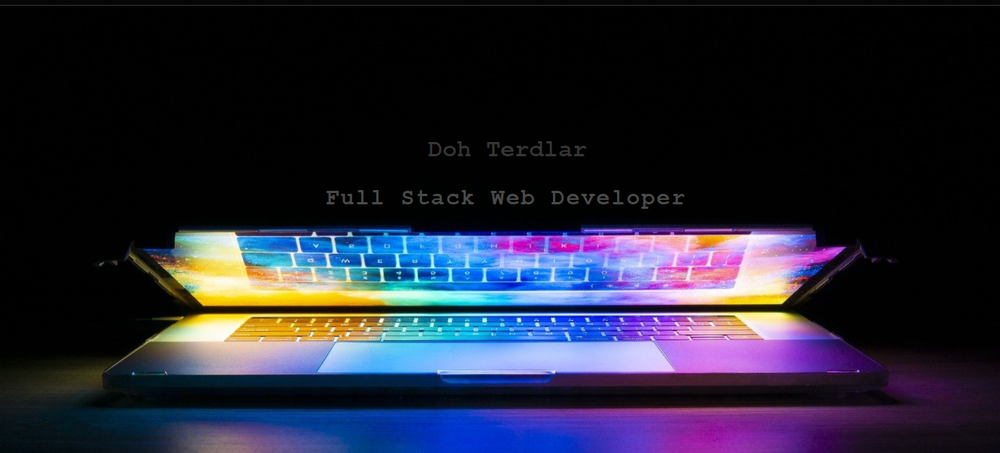

# myportfolio-app
 This application will display my professional portfolio and projects including teachnologies am familiar working with. It will feature a simple mobile first layout which will automatically resize itself based on the screen size. It also includes tiles and links to my projects, github repositories and live sites as well as links to my linkedIn, GitHub repo and YouTube channel.

 # Update Frequency
 As i work on more projects, this app will frequently be updated with their descriptions, motivation for the project, problem it solves and links to the deployed site and repositories.

[Live site](ttps://terd47.github.io/myportfolio-app/)https://terd47.github.io/myportfolio-app/

[Repository](https://github.com/Terd47/myportfolio-app)

